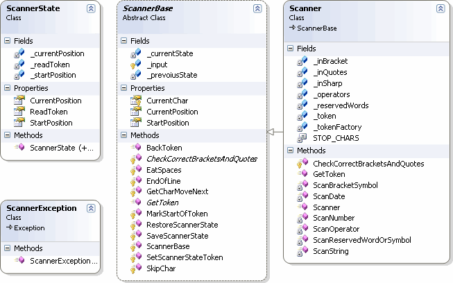
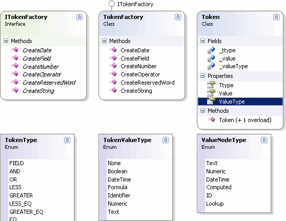
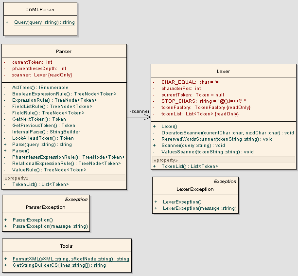
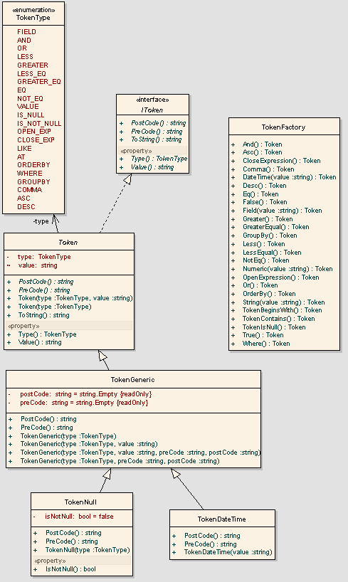
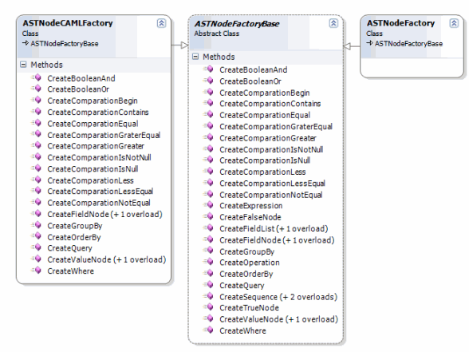

# YACAMLQP

YACAMLQT, es una utilidad que convierte una sentencia SQL en CAML, el lenguaje de consulta de Sharepoint. (Véase YACAMLQT, YACAMLQT2 y YACAMLQT-CAML.Net)

Estos días entre rato bueno y rato malo, he reescrito totalmente el código de YACAMLQT, para hacerlo más sencillo (por supuesto usando TDD), en principio el objetivo ha sido emular el antiguo YACAMLQT, pero dotándolo de un diseño más sencillo y ampliable.

YACAMLQT, es un programa que convierte una sintaxis tipo SQL en CAML (el lenguaje de consulta de SharePoint).

Es decir esto:

```sql
WHERE ((Column1 = “Value1”) AND (Column2 = “Value2”)) OR ((Column3 = 10) 
AND (Column3 <> NULL)) GROUPBY Column1 ORDERBY Column1, Column2 ASC, Column3 DESC
```

En esto:

```xml
<Query>
  <Where>
    <Or>
      <And>
        <Eq>
          <FieldRef Name="Column1" />
          <Value Type="Text">Value1</Value>
        </Eq>
        <Eq>
          <FieldRef Name="Column2" />
          <Value Type="Text">Value2</Value>
        </Eq>
      </And>
      <And>
        <Eq>
          <FieldRef Name="Column3" />
          <Value Type="Integer">10</Value>
        </Eq>
        <IsNotNull>
          <FieldRef Name="Column3" />
        </IsNotNull>
      </And>
    </Or>
  </Where>
  <GroupBy>
    <FieldRef Name="Column1" />
  </GroupBy>
  <OrderBy>
    <FieldRef Name="Column1" />
    <FieldRef Name="Column2" Ascending="True" />
    <FieldRef Name="Column3" Ascending="False" />
  </OrderBy>
</Query>
```

El proyecto completo lo subiré a CodePlex en unos días, con su código fuente que poco a poco y con ayuda espero ir ampliando.

Por si alguien quiere echar una mano en el proyecto, voy a contar alguno de los entresijos del diseño de la aplicación.

Lo primero que he diseñado es el analizador morfológico (lexer) que se encarga de identificar dentro de un string, las distintas unidades sintácticas (tokens) con las que construiremos un analizador sintáctico y semántico (parser) con el cual construiremos un árbol sintáctico (AST) que por último recorreremos para transformar el SQL en CAML u otra variante como CAML.Net.

El lexer, está compuesto por una clase base, ScannerBase que contiene las partes más básicas del lexer, he extraído esta clase base una vez que tenía el analizador morfológico completo ya que de esta manera podemos realizar otro tipo de analizadores.

Las funciones básicas como comerse los espacios (EatSpaces()), detectar si es el final de línea (EndOfLine()) , saltar caracteres (SkipChar()) son parte de ScannerBase. Lo más importante de esta clase es la propiedad CurrentChar que devuelve el último carácter leído y el método GetCharMoveNext(), que obtiene un carácter y se mueve a la siguiente posición.

Para los que habéis usado el unix flex, GetCharMoveNext() es similar a input().

Esta clase ScannerBase utiliza internamente una clase ScannerState que mantiene el estado para poder releer un token ó unidad sintáctica.

Los tokens en el caso de YACAMLQT, consisten en las palabras reservadas propias de SQL, así como los distintos operadores, los campos y los valores (cadena, fecha, lógico y numérico).

A diferencia del unix flex, esto no se trata de un unput(), ya que mediante este volveríamos al carácter anterior. En este caso, como lo importante del analizador es obtener una unidad sintáctica, o token, lo que he hecho es implementar un método llamado BackToken() que lo que hace es posicionar el lexer justo al comienzo del último token obtenido, de modo que GetToken() volverá a devolvernos el mismo token.

La clase Scanner, hereda como es de suponer de ScannerBase, e implementa GetToken(), el responsable de de devolver un token, y CheckCorrectBracketsAndQuotes() que es el responsable de comprobar que los paréntesis y las comillas están correctamente.



Dentro de la clase Scanner, el método GetToken() es el responsable de identificar cada uno de los tokens, para lo cual he realizado un método para identificar cada uno de los distintos tokens. GetToken() usa los métodos ScanDate(), ScanString(), ScanOperator(), ScanNumber() y ScanReservedWordOrSymbol().

ScanOperator() y ScanReservedWordOrSymbol() usan un diccionario para identificar los distintos operadores y palabras reservadas. En el caso de ScanReservedWordOrSymbol(), si el token leído no se encuentra en el diccionario de palabras reservadas estaremos identificando un símbolo ó identificador.

Para terminar con esta primera parte, y siguiendo el principio de responsabilidad única, se ha implementado la clase Token como un contenedor y TokenFactory como una factória encargada de crear los distintos tipos de tokens ó unidades sintácticas. La clase Scanner es la que usa la factória para crear los distintos Tokens.

La clase Token, puede contener los distintos tipos de tokens, en principio todos aunque pueden ser de diferentes tipos, mantendrán su valor como un string. El resto de propiedades para identificar el tipo de token (TType) ó el tipo de valor (ValueType) son una enumeración.



Habíamos visto la parte relacionada con el Lexer el analizador morfológico. Como es obvio detrás debe haber un analizador sintáctico y semántico el Parser.

El analizador sintáctico y semántico (NParser) se ha implementado siguiendo el patrón interpeter, (seguramente sea uno de los que menos se ven), el objetivo es obtener los distintos Tokens desde el Scanner y montar un árbol sintáctico (AST) este árbol contiene Nodos (ASTNodeBase) y estos nodos representan de manera abstracta y simplificada la estructura sintáctica de la consulta en SQL.

(diagrama NParser)


A la clase NParser se le puede inyectar una factoria (ASTNodeFactoryBase) en función del código que queramos generar, por el momento solo esta implementado el CAML, pero se puede extender sencillamente para generar CAML.Net.

Partiendo de un nodo abstracto (ASTNodeBase) podemos definir las distintas unidades sintácticas, por medio de la herencia. Estos nodos abstractos (heredados de ASTNodeBase ) conforman las distintas expresiones que se usan en el analizador sintáctico y semántico (NParser), para ello se ha definido una clase para cada uno de los Tokens a modo de plantilla (template),  y estas clases son a su vez son las distintas expresiones abstractas, que se usan en  el patrón interpreter implementado en el parser. (NParser).

Todos estos nodos que forman las expresiones abstractas al fin al cabo son plantillas (templates), y podrían a su vez ser clases abstractas, yo opte por una implementarlas como clases normales. Ya que algunos de los nodos son terminales y otros intermedios y no tienen por qué ser heredados, de este modo la factoria base (ASTNodeFactoryBase) usa miembros virtuales parar crear dichos nodos.

(diagrama parcial de ASTNodeBase)


Para crear todos estas expresiones abstractas existe una factoría abstracta (ASTNodeFactoryBase ) a través de la cual creamos los distintos nodos. Como puede verse, para añadir una variante como CAML.Net, solamente hay que añadir las expresiones abstractas heredando de las ya existentes e implementando PreCode() y PostCode().

Todos estos nodos que forman las expresiones abstractas al fin al cabo son plantillas (templates), y podrían a su vez ser clases abstractas, yo opte por una implementarlas como clases normales, debido a que algunos de los nodos son terminales y otros intermedios y no tienen por qué ser heredados, de este modo la factoria base (ASTNodeFactoryBase) usa miembros virtuales parar crear dichos nodos terminales e intermedios.

Después para poder inyectar en el parser dichas expresiones debemos crear una nueva factoría heredada de la factoría base (ASTNodeFactoryBase).

(diagrama ASTNodeFactoryBase)


Para generar CAML lo que he hecho es heredar de cada plantilla ó expresión abstracta definida, una nueva clase que redefine los métodos virtuales PreCode() y PostCode() que son los encargados de sustituir cada nodo del árbol sintáctico en CAML.

Y crear una factoría (ASTNodeCAMLFactory) que se encarga de crear las expresiones.

Bueno, esta es la última entrega a partir de hoy el proyecto se encuentra en CodePlex (yacamlqt.codeplex.com).

En esta última parte solo unas pequeñas notas para el usuario final.

Bien, para usar YACAMLQT, dentro de tus proyectos, solo hay que referenciar la dll (IdeSeg.SharePoint.Caml.QueryParser.dll)  y el uso sería el siguiente:

```
   1:              try
   2:              {
   3:                  var parser = new NParser(textTSql, new ASTNodeCAMLFactory());
   4:                  var generator = new CodeGenerator(parser.Parse());
   5:                  generator.Generate();
   6:                  return _formatTools.FormatXml(generator.Code);
   7:              }
   8:              catch (ParserException ex)
   9:              {
  10:                  _view.Status = ex.Message;
  11:              }
  12:              catch (ScannerException ex)
  13:              {
  14:                  _view.Status = ex.Message;
  15:              }
```

Instanciamos el Parser (NParser), le pasamos la consulta en TSQL (textSql) y la factoría correspondiente a lo que queremos generar, por el momento solo está disponible la de CAML, en breve completaré la de CAML.Net; Por último inyectamos el Parser en el Generador de código, llamamos al método Generate y recogemos la consulta en CAML en generator.Code.

Las posibles excepciones tanto del Parser como del generador de código se pueden atrapar con ParserException y ScannerException.

En el proyecto se incluye un pequeño subproyecto con una interfaz WinForms (no es que se me de especialmente bien)
